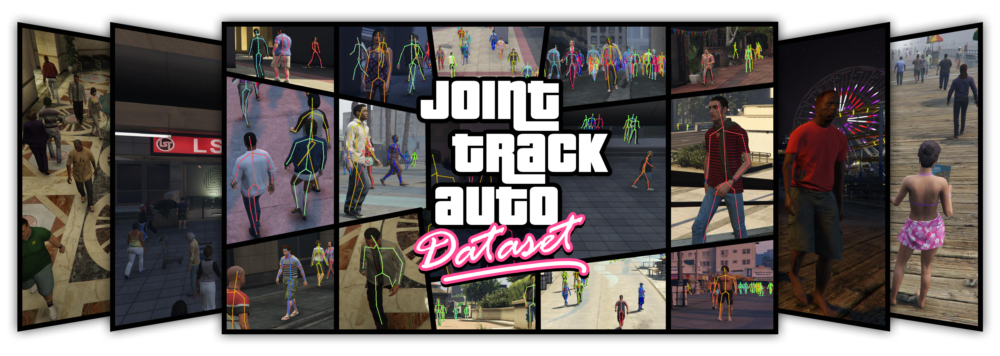

# JTA Dataset Utilities

JTA (_Joint Track Auto_) is a huge dataset for pedestrian pose estimation and tracking in urban scenarios created by exploiting the highly photorealistic video game *Grand Theft Auto V* developed by *Rockstar North*. 
We collected a set of 512 full-HD videos (256 for training and 256 for testing), 30 seconds long, recorded at 30 fps.




## ZIP file Content 

The ZIP file contains:
- `annotations`: directory with dataset annotations
    - `annotations/train`: directory with 256 annotation files (.JSON), one for each training sequence
    - `annotations/test`: directory with 128 annotation files (.JSON), one for each testing sequence
    - `annotations/val`: directory with 128 annotation files (.JSON), one for each validation sequence

- `videos`: directory with dataset videos
    - `videos/train`: directory with 256 videos (.MP4), one for each training sequence
    - `videos/test`: directory with 128 videos (.MP4), one for each testing sequence
    - `videos/val`: directory with 128 videos (.MP4), one for each validation sequence

- `to_imgs.py`: Python script that, given a video, splits it into its frames and saves them in a specified directory with the desired format (default = `JPG`)

    - tested with Python 3.6.5

    - requires `click`, `imageio` and `path`

    - use `python to_imgs.py --help` to read the help message

    - usage example: 

        ````bash
        python to_imgs.py --in_mp4_file_path='videos/train/seq_42.mp4' --out_dir_path='frames/seq_42'
        ````

- `visualize.py`: Python script that provides a visual representation of the annotations.

    - tested with Python 3.6.5

    - requires `click`, `cv2`, `imageio`,  `matplotlib`, `numpy`,  and `path`

    - use `python visualize.py --help` to read the help message

    - usage example: 

      ```bash
      python to_imgs.py --in_mp4_file_path='videos/train/seq_42.mp4' --json_file_path='annotations/train/seq_42.json' --out_mp4_file_path='vis_ann/seq_42.mp4'
      ```


## Annotations 

Each annotation file refers to a specific sequence (e.g. `seq_42.json` is the video annotation file `seq_42.mp4`). An annotation file consists of a list of lists, that is a matrix having _N_ rows and 10 columns. Each row of the matrix contains the data of a joint; these data are organized as follows:

| Element  | Name          | Description                                                   |
| -------- | ------------- | ------------------------------------------------------------- |
| `row[0]` | frame number  | number of the frame to which the joint belongs                |
| `row[1]` | person ID     | unique identifier of the person to which the joint belongs    |
| `row[2]` | joint type    | identifier of the type of joint; see 'Joint Types' subsection |
| `row[3]` | x2D           | 2D _x_ coordinate of the joint in pixel                       |
| `row[4]` | y2D           | 2D y coordinate of the joint in pixel                         |
| `row[5]` | x3D           | 3D _x_ coordinate of the joint in meters                      |
| `row[6]` | y3D           | 3D y coordinate of the joint in meters                        |
| `row[7]` | z3D           | 3D z coordinate of the joint in meters                        |
| `row[8]` | occluded      | `1` if the joint is occluded; `0` otherwise                   |
| `row[9]` | self-occluded | `1` if the joint is occluded by its owner; `0` otherwise      |

* _Note_: 3D coordinates are relative to the position of the camera.

#### Joint Types

The associations between numerical identifier and type of joint are the following:

```
0:  head_top
1:  head_center
2:  neck
3:  right_clavicle
4:  right_shoulder
5:  right_elbow
6:  right_wrist
7:  left_clavicle
8:  left_shoulder
9:  left_elbow
10: left_wrist
11: spine0
12: spine1
13: spine2
14: spine3
15: spine4
16: right_hip
17: right_knee
18: right_ankle
19: left_hip
20: left_knee
21: left_ankle
```

### Annotation Management - Example

* Read data of an annotation file and convert it to numpy array:

  ```python
  import json
  import numpy as np
  
  json_file_path = 'annotations/training/seq_42.json'
  
  with open(json_file_path, 'r') as json_file:
      matrix = json.load(json_file)
      matrix = np.array(matrix)
  ```

- Get data of frame #118:

  ```python
  frame_data = matrix[matrix[:, 0] == 118]
  ```

- Get data of all the joints of person with ID=3 in frame #118:

  ```python
  person_data = frame_data[frame_data[:, 1] == 3]
  ```
  
## Citation

We believe in open research and we are happy if you find this data useful. If you use it, please cite our [work](https://arxiv.org/abs/1803.08319).

```latex
@inproceedings{fabbri2018learning,
   title   = {Learning to Detect and Track Visible and Occluded Body Joints in a Virtual World},
   author  = {Fabbri, Matteo and Lanzi, Fabio and Calderara, Simone and Palazzi, Andrea and Vezzani, Roberto and Cucchiara, Rita},
   journal = {ECCV},
   year    = {2018}
 }
```
